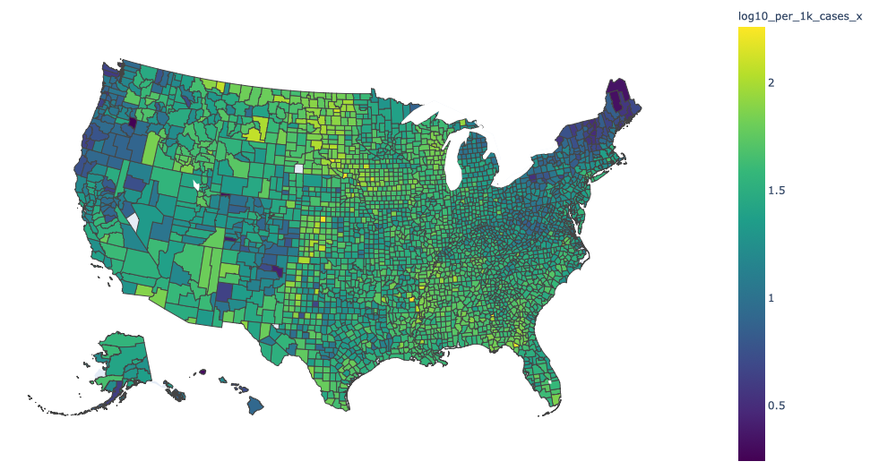

# county_counting
This is a collection of scripts to automate data normalization and visualization (data curated by the New York Times and census.gov).

<<<<<<< HEAD

=======

>>>>>>> 4a69d41d5927f225982509b5f5053bc52163e273
